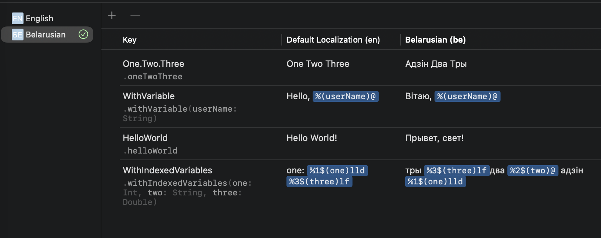
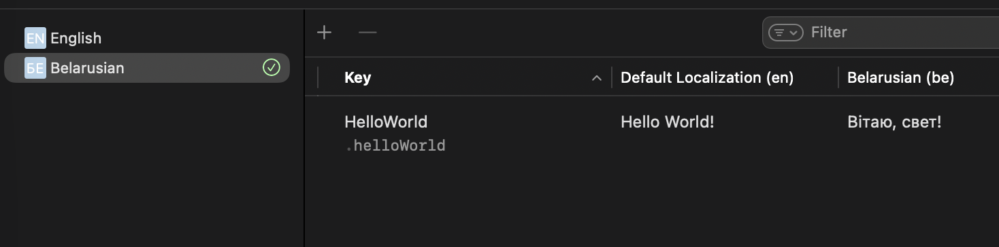
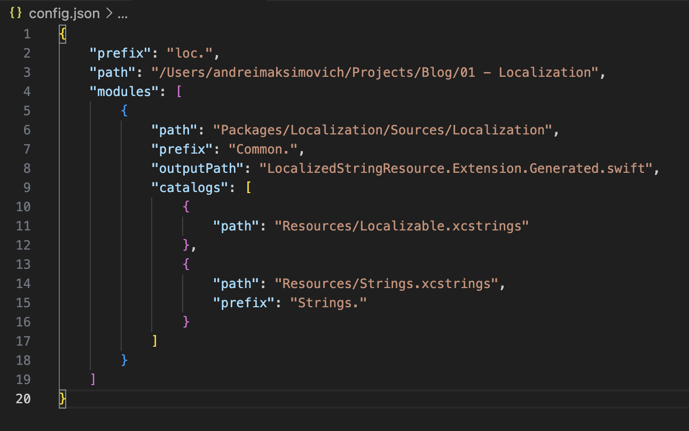
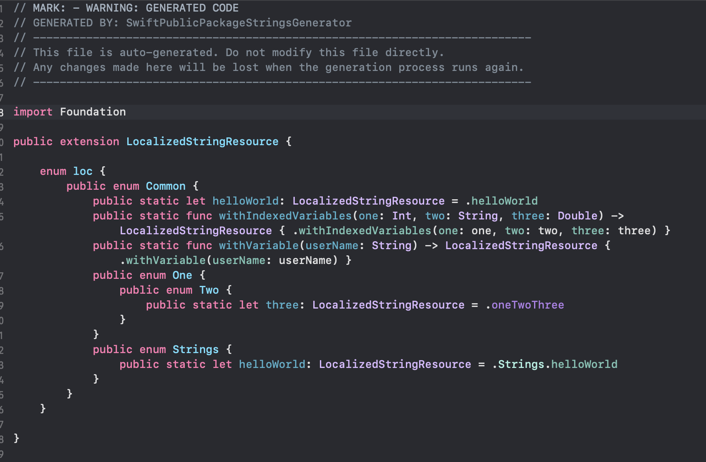
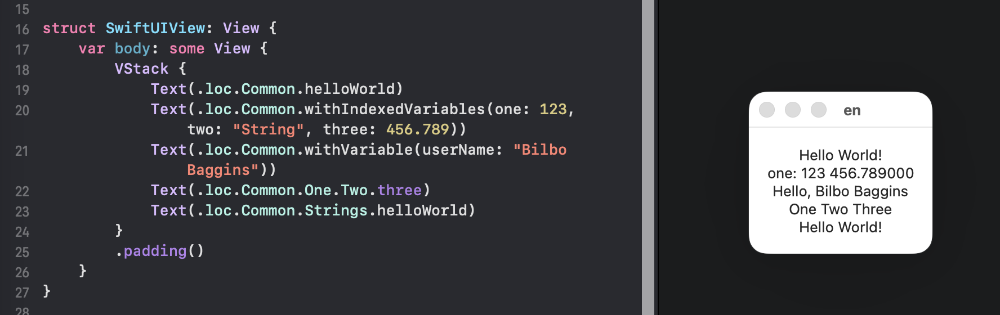
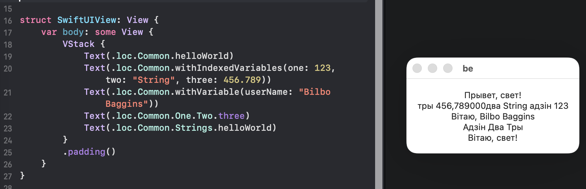

# SwiftPublicPackageStringsGenerator

A lightweight Node.js utility designed to automate the generation of public LocalizedStringResource properties and functions. This tool allows external modules to easily access localized strings defined within Swift Packages.

## Installation
1. Clone the repository
2. Install Node.js & npm.
3. Navigate to the project directory and execute the following command: ``npm install``.

## Configuration:
Create a JSON configuration file. You can use ``config.example.json`` in the root directory as an example.

## Run the Generator:
Navigate to the project directory and execute the following command:
``npm run generate -- -c path/to/your/configuration.json``
Note: If the ``-c`` flag is omitted, the tool will default to using config.json in the project root.

## Notice
I developed this tool in a single day for personal use, this tool currently supports string catalogs where variables are either fully indexed or entirely unindexed. I plan to expand its flexibility and feature set over time.

## Example
* String catalog: Localizable

* String catalog: Strings

* Configuration file

* Generated code

* Usage example

